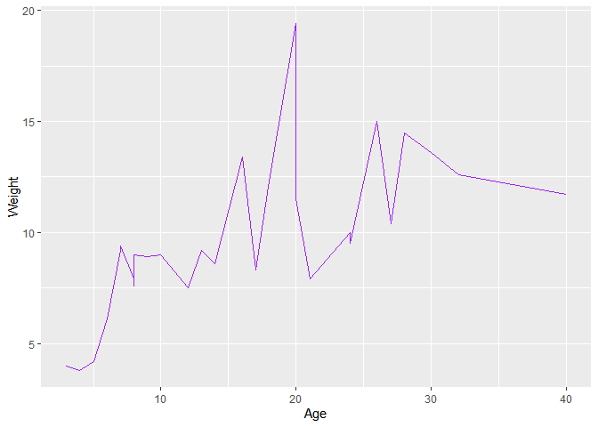

Hmk_04
================
Elaine M. Wright

## Homework \#4 - GGPlotting

-   The tidyverse library has been loaded in, and the messages are
    silenced

-   I created a fake data set about 30 random cats, I ran the csv file
    to make sure the data would load into the document accurately and I
    assigned my csv file to an object for easy reference

-   Then I plotted a line graph of the Age vs Weight of all 30 cats.
    While the line graph is accurate in plotting this data, a scatter
    plot would be better for this representation of Age vs Weight.

``` r
library(tidyverse)
read.csv("cats_data_hmw_04.csv")
```

         Coat Age Weight LikesString LikesFeathers Food
    1   Black   9    8.9          No            No  Dry
    2    Gray  17    8.3         Yes           Yes  Wet
    3   White   3    4.0          No           Yes  Dry
    4   Tabby  12    7.5         Yes           Yes  Dry
    5  Tortie  24   10.0         Yes            No  Wet
    6  Orange  28   14.5         Yes            No  Wet
    7   Black   8    7.9         Yes           Yes  Dry
    8   White   5    4.2          No            No  Dry
    9   Tabby   7    9.2         Yes           Yes  Dry
    10 Orange  26   15.0         Yes            No  Wet
    11  Brown  30   13.6         Yes           Yes  Wet
    12  Black  40   11.7          No            No  Wet
    13  Black  32   12.6          No           Yes  Wet
    14 Tuxedo  24    9.5          No           Yes  Wet
    15 Tuxedo   8    7.6         Yes           Yes  Dry
    16  White   6    6.1          No            No  Dry
    17   Gray  10    9.0         Yes            No  Wet
    18 Tortie  14    8.6          No            No  Wet
    19  White  20   19.4          No            No  Wet
    20  Black  27   10.4          No            No  Wet
    21 Tuxedo  21    7.9          No            No  Wet
    22 Orange   4    3.8         Yes           Yes  Dry
    23  Black  13    9.2         Yes           Yes  Wet
    24  Black   8    7.8         Yes           Yes  Dry
    25 Tuxedo   7    9.4          No            No  Dry
    26  White  20   11.5         Yes           Yes  Wet
    27   Gray  16   13.4          No            No  Wet
    28  Black   8    9.0          No           Yes  Dry
    29  White  18   12.3         Yes           Yes  Wet

``` r
cats <- read.csv("cats_data_hmw_04.csv")
ggplot(cats) +
  geom_line(aes(x=Age, y=Weight), color="purple")
```


