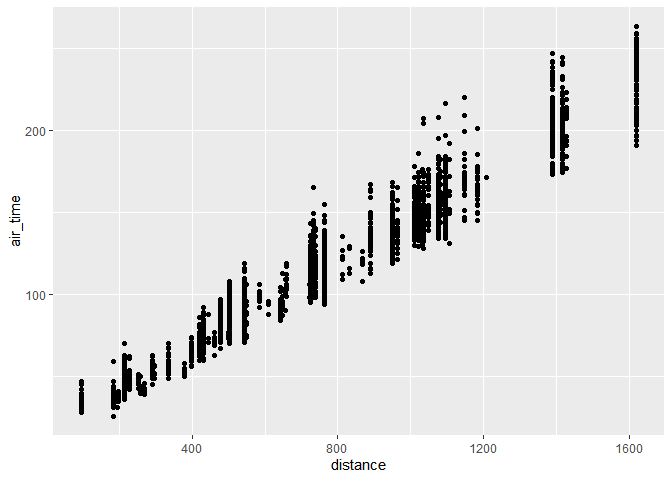
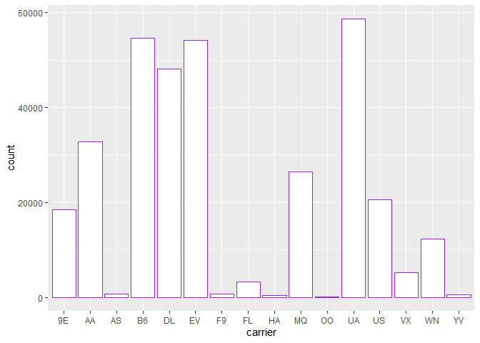

Hmk_05
================
Elaine M. Wright

## Installing Packages:

``` r
library(nycflights13)
library(tidyverse)

#Test to make sure package loaded successfully
nycflights13::flights
```

    # A tibble: 336,776 × 19
        year month   day dep_time sched_de…¹ dep_d…² arr_t…³ sched…⁴ arr_d…⁵ carrier
       <int> <int> <int>    <int>      <int>   <dbl>   <int>   <int>   <dbl> <chr>  
     1  2013     1     1      517        515       2     830     819      11 UA     
     2  2013     1     1      533        529       4     850     830      20 UA     
     3  2013     1     1      542        540       2     923     850      33 AA     
     4  2013     1     1      544        545      -1    1004    1022     -18 B6     
     5  2013     1     1      554        600      -6     812     837     -25 DL     
     6  2013     1     1      554        558      -4     740     728      12 UA     
     7  2013     1     1      555        600      -5     913     854      19 B6     
     8  2013     1     1      557        600      -3     709     723     -14 EV     
     9  2013     1     1      557        600      -3     838     846      -8 B6     
    10  2013     1     1      558        600      -2     753     745       8 AA     
    # … with 336,766 more rows, 9 more variables: flight <int>, tailnum <chr>,
    #   origin <chr>, dest <chr>, air_time <dbl>, distance <dbl>, hour <dbl>,
    #   minute <dbl>, time_hour <dttm>, and abbreviated variable names
    #   ¹​sched_dep_time, ²​dep_delay, ³​arr_time, ⁴​sched_arr_time, ⁵​arr_delay

## Filtering:

A plot of air time as a function of distance for all flights that meet
the following criteria:

-   originate from LaGuardia airport (“LGA”)
-   departed on the 16th of the month
-   have a flight distance of less than 2000

``` r
filtered <- filter(flights, origin == "LGA", day == 16, air_time < 2000)
ggplot(filtered, aes(x=distance, y=air_time)) +
  geom_point()
```



## Dealing With NA’s:

A new data frame of all of the rows of `flights` that have values for
*both* `arr_time` and `dep_time`, where neither value is `NA`.

``` r
filter(flights, arr_time != "NA" & dep_time != "NA")
```

    # A tibble: 328,063 × 19
        year month   day dep_time sched_de…¹ dep_d…² arr_t…³ sched…⁴ arr_d…⁵ carrier
       <int> <int> <int>    <int>      <int>   <dbl>   <int>   <int>   <dbl> <chr>  
     1  2013     1     1      517        515       2     830     819      11 UA     
     2  2013     1     1      533        529       4     850     830      20 UA     
     3  2013     1     1      542        540       2     923     850      33 AA     
     4  2013     1     1      544        545      -1    1004    1022     -18 B6     
     5  2013     1     1      554        600      -6     812     837     -25 DL     
     6  2013     1     1      554        558      -4     740     728      12 UA     
     7  2013     1     1      555        600      -5     913     854      19 B6     
     8  2013     1     1      557        600      -3     709     723     -14 EV     
     9  2013     1     1      557        600      -3     838     846      -8 B6     
    10  2013     1     1      558        600      -2     753     745       8 AA     
    # … with 328,053 more rows, 9 more variables: flight <int>, tailnum <chr>,
    #   origin <chr>, dest <chr>, air_time <dbl>, distance <dbl>, hour <dbl>,
    #   minute <dbl>, time_hour <dttm>, and abbreviated variable names
    #   ¹​sched_dep_time, ²​dep_delay, ³​arr_time, ⁴​sched_arr_time, ⁵​arr_delay

## Filtering NA’s:

Preventing NA values from appearing in the first place can be done with
`na.rm = TRUE`

## Adding Columns:

A new data frame was selected to show the airline carrier, the air time,
and the distance of the flight. A new column was added to the data frame
using `mutate()` showing the average flight speed based `air_time` and
`distance`. A histogram plot was made and shows the average flight speed
for every air line carrier.

``` r
average <- select(flights, carrier, air_time, distance)
mutate(average,
       speed = distance / air_time)
```

    # A tibble: 336,776 × 4
       carrier air_time distance speed
       <chr>      <dbl>    <dbl> <dbl>
     1 UA           227     1400  6.17
     2 UA           227     1416  6.24
     3 AA           160     1089  6.81
     4 B6           183     1576  8.61
     5 DL           116      762  6.57
     6 UA           150      719  4.79
     7 B6           158     1065  6.74
     8 EV            53      229  4.32
     9 B6           140      944  6.74
    10 AA           138      733  5.31
    # … with 336,766 more rows

``` r
ggplot(average, aes(x=carrier)) +
  geom_histogram(stat = "count", color = "purple", fill = "white")
```

    Warning: Ignoring unknown parameters: binwidth, bins, pad


