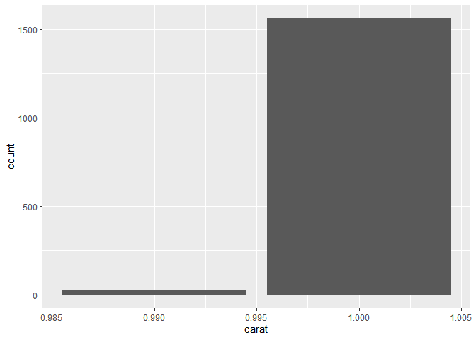
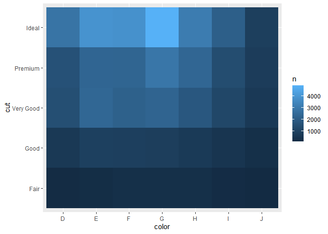
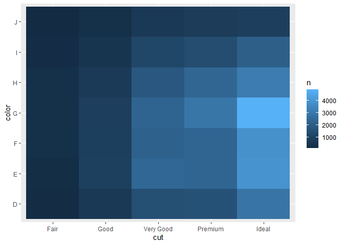
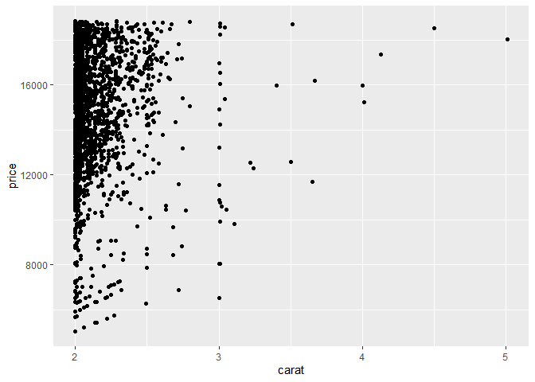
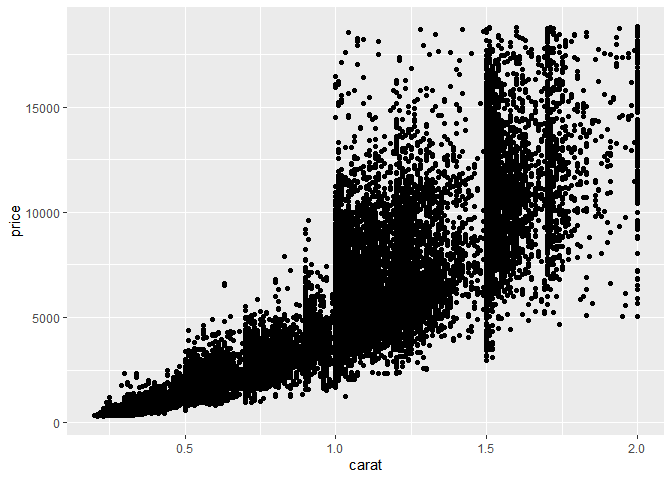

Hmk_06
================
Elaine M. Wright

## Homework 06

### Exercise 1 - Bad Data

I think some data that qualifies as bad within this data set is any
diamond with a carat value over 3. I say this mainly because I do not
think the data set has enough diamonds with a carat value greater than 3
to be an accurate representation of the other variables for diamonds
over 3 carats. I have created a new data frame to exclude diamonds with
carat values greater or equal to 3.

``` r
library(tidyverse)
view(diamonds)
w_o_three_carat <- filter(diamonds, carat <= 3)
view(w_o_three_carat)
```

Diamonds Data Set - Variables  
**price:** price in US \$

**carat:** weight of diamond

**cut:** quality of cut (Fair, Good, Very Good, Premium, Ideal)

**color:** diamond color, from D to J (best to worst)

**clarity:** a measurement of how clear the diamond is - (I1 (worst),
SI2, SI1, VS2, VS1, VVS2, VVS1, IF (best))

**x:** length in mm

**y:** width in mm

**z:** depth in mm

**depth total percentage** = z / mean(x, y) = 2 \* z / (x + y)

**table:** width of top of diamond relative to widest point

### Exercise 2

How many diamonds are 0.99 carat? How many are 1 carat? What do you
think is the cause of the difference?

There are 23 diamonds that are 0.99 carats, where as there are 1558
diamonds that are 1.00 carat. I think a cause of this could be because
diamonds that are considered a full carat will not only sell easier but
will also sell for more money. This is more appealing to both the
consumer and the seller by having a diamond that is considered a full
carat.

``` r
carat <- filter(diamonds, carat == 0.99 | carat == 1.00)

ggplot(data = carat) +
  geom_bar(mapping = aes(x = carat))
```



``` r
carat %>% 
  count(carat)
```

    # A tibble: 2 × 2
      carat     n
      <dbl> <int>
    1  0.99    23
    2  1     1558

### Exercise 3

Why is it slightly better to use `aes(x = color, y = cut)` rather than
`aes(x = cut, y = color)` in the example above?

I think using `aes(x = color, y = cut)` rather than
`aes(x = cut, y = color)` is better because it is more inherently
understandable to put color on the x axis. This makes it so each color
is its own column rather than a row, and this is helpful because each
cut options increases in quality of the diamond, so having cut on the y
axis as a function of the color of the diamond is the easiest to
understand. This orientation also makes sense because there are more
color options than cut options, so expanding the graph on the x axis for
the amount of color options is more aesthetically pleasing.

``` r
diamonds %>% 
  count(color, cut) %>%  
  ggplot(mapping = aes(x = color, y = cut)) +
    geom_tile(mapping = aes(fill = n))
```



``` r
diamonds %>% 
  count(color, cut) %>%  
  ggplot(mapping = aes(x = cut, y = color)) +
    geom_tile(mapping = aes(fill = n))
```



### Exercise 4 - From 7.5.3.1

How does the price distribution of very large diamonds compare to small
diamonds? Is it as you expect, or does it surprise you?

I defined very large diamonds as anything over 2 carats, and anything
under 2 carats was considered a small diamond. The small diamond plot
was as expected, as the carat of the diamond gets larger, the price
increases. However, on the large diamonds plot, the price doesn’t change
as much as I expected it to. I think this is largely because of the
other factors involved in the price of a diamond such as color and
clarity as well as cut. I also think this may be because the data set
does not include many diamonds above 3 carats, which limits the sample
size of the big diamonds filtered data set.

``` r
big_diamonds <- filter(diamonds, carat >= 2.00)
ggplot(big_diamonds, aes(x = carat, y = price)) +
  geom_point()
```



``` r
small_diamonds <- filter(diamonds, carat <= 2.00)
ggplot(small_diamonds, aes(x = carat, y = price)) +
  geom_point()
```


