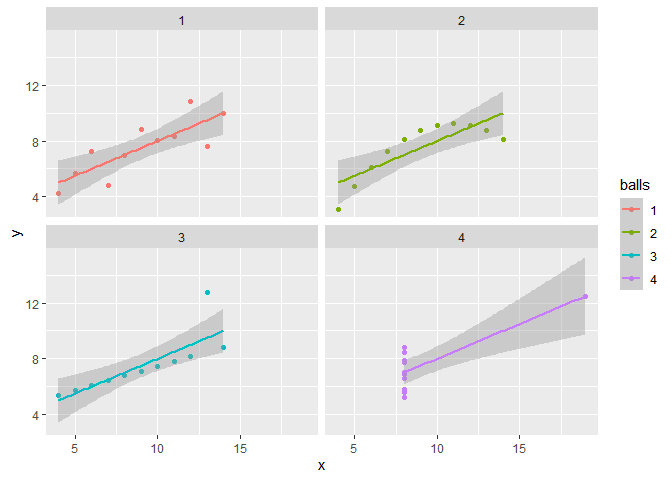
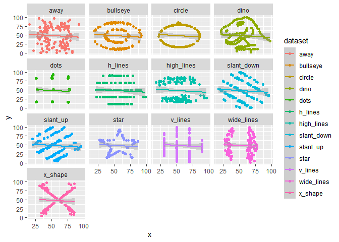
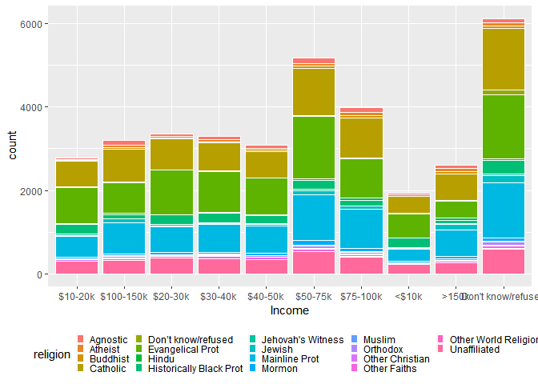
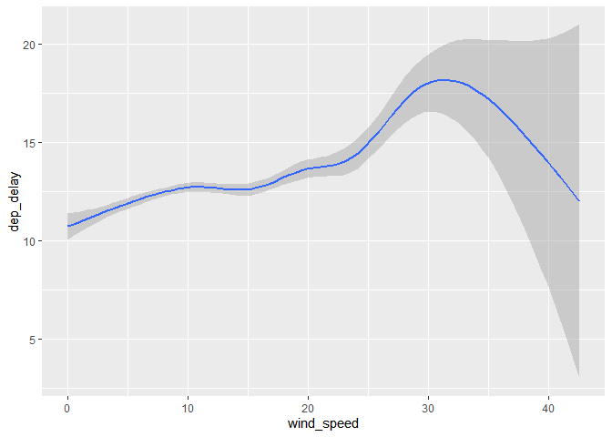

Summarising, Reshaping, Merging
================
Elaine M. Wright

# Q1: Summarising operations and exploratory data analysis

``` r
library(tidyverse)
library(nycflights13)
```

### Q1a

Download `experiment1.csv` from Canvas (under files). This reports two
variables from an experiment that has four treatments. Creatively, the
treatments are `1`, `2`, `3`, and `4`, and the two variables are `x` and
`y`. Create a data frame that contains the mean, standard deviation, and
number of points for each treatment. You will want to use functions like
`summarise()`, `group_by()`, `mean()`, and `sd()`.

``` r
df1 <- read.csv("experiment1.csv")

df1 <- df1 %>% 
  group_by(balls)

df1$balls <- as.character(df1$balls)

ggplot(df1, aes(x = x, y = y, color = balls)) +
  geom_point() +
  geom_smooth(method = "lm") +
  facet_wrap(~balls)
```

    `geom_smooth()` using formula 'y ~ x'



``` r
# Dataframe Summary
summary_df1 <- df1 %>% 
  summarise(n = n(),
            mean_x = mean(x),
            stan_dev_x = sd(x),
            mean_y = mean(y),
            stan_dev_y = sd(y))

summary_df1
```

    # A tibble: 4 × 6
      balls     n mean_x stan_dev_x mean_y stan_dev_y
      <chr> <int>  <dbl>      <dbl>  <dbl>      <dbl>
    1 1        11      9       3.32   7.50       2.03
    2 2        11      9       3.32   7.50       2.03
    3 3        11      9       3.32   7.5        2.03
    4 4        11      9       3.32   7.50       2.03

**Are the data sets different in any important way?**

The faceted plot shows the varied spread of the data based on each
treatment. However, the data sets are nearly statistically identical.
This is shown by the means and standard deviations of both x and y being
approximately equal.

### Q1b

Now load the file `experiment2.csv`. Again, this describes two variables
for multiple treatments (here called `dataset`). Answer the same
questions as above.

``` r
df2 <- read.csv("experiment2.csv")

df2 <- df2 %>% 
  group_by(dataset)

ggplot(df2, aes(x = x, y = y, color = dataset)) +
  geom_point() +
  geom_smooth(method = "lm") +
  facet_wrap(~dataset)
```

    `geom_smooth()` using formula 'y ~ x'



``` r
# Dataframe Summary
summary_df2 <- df2 %>% 
  summarise(n = n(),
            mean_x = mean(x),
            stan_dev_x = sd(x),
            mean_y = mean(y),
            stan_dev_y = sd(y))

summary_df2
```

    # A tibble: 13 × 6
       dataset        n mean_x stan_dev_x mean_y stan_dev_y
       <chr>      <int>  <dbl>      <dbl>  <dbl>      <dbl>
     1 away         142   54.3       16.8   47.8       26.9
     2 bullseye     142   54.3       16.8   47.8       26.9
     3 circle       142   54.3       16.8   47.8       26.9
     4 dino         142   54.3       16.8   47.8       26.9
     5 dots         142   54.3       16.8   47.8       26.9
     6 h_lines      142   54.3       16.8   47.8       26.9
     7 high_lines   142   54.3       16.8   47.8       26.9
     8 slant_down   142   54.3       16.8   47.8       26.9
     9 slant_up     142   54.3       16.8   47.8       26.9
    10 star         142   54.3       16.8   47.8       26.9
    11 v_lines      142   54.3       16.8   47.8       26.9
    12 wide_lines   142   54.3       16.8   47.8       26.9
    13 x_shape      142   54.3       16.8   47.8       26.9

**Are the data sets different in any important way?**

This answer is similar to the first data set observed. The number of
observations as well as the means and standard deviations are all nearly
idential, which would lead to the conclusion that these data sets are
all showing the same information. However, when we show the data in a
faceted format, it is easily seen that these data sets have very
different distributions. And a side note, I think these shapes are so
fun!

# Q2: Pivoting

Create a plot that illustrates the differences in income among
religions, using the `relig_income` data set that is built into
tidyverse.

``` r
df3 <- relig_income %>% 
  pivot_longer(!religion,  values_to = "count", names_to = "Income") %>% 
  group_by(religion)

df3$Income <- as.character(df3$Income, levels = c("Refused", "<$5k", "$5-10k", "$10-20k", "$20-30k", "$30-40k", "$40-50k", "$50-60k", "$60-70k", "$70-80k", "$80-90k", "$90-100k", "$100-150k", ">150k"))

ggplot(df3, aes(x = Income, y = count, fill = religion)) +
  geom_col(color = "white")+
  theme(legend.position = "bottom", legend.key.size = unit(0.5, "lines"))
```



# Q3: Merging

### Q3a: Meaning of Joins

**Explain the difference between a left join, a right join, an inner
join, and an outer join.**

I used the help feature in R to learn more about each of these joins and
explain them efficiently. (Honestly I think this is one of the best
features of R Studio)

Joins manipulate/add columns “from y to x” based on specific keys.

**Right join:** A right join takes two data sets and keeps all objects
of the right data set, joins the values from the second/left data set to
match the objects in the right data set. Objects in the left data set
are removed from the joined data set. However, objects from the right
data set are not removed.

**Left join:** A left join takes two data sets and keeps all objects of
the left data set, joins the values from the second/right data set to
match the objects in the left data set. Objects in the right data set
are removed from the joined data set. However, objects from the left
data set are not removed.

**Inner join:** An inner join will keep both objects in the right and
left data sets. However, an inner join will remove objects that are in
neither data set.

**Outer join:** An outer join will keep all objects that are in either
data set.

### Q3b: Using Joins

Using the `flights` and `weather` data sets from `nycflights13`,
determine whether there is a correlation between average hourly wind
speed and departure delays at NY airports.

This is a question about joins: you will need to join the `flights` and
`weather` by year, month, day, and hour. However, note that `flights`
has encoded departure time in a particularly annoying way: as an
integers. For instance, the integer 517 indicates 5:17 am.

`weather` gives average weather conditions each hour, with the hour
given as an integer (e.g., 5 indicating 5-6 am). You’re going to have to
figure out how to convert the time in `flights` into a form that matches
the form in `weather`.

If you want, you can use the `lm()` function to make a linear model of
departure delay as a function of wind speed. But it is also fine to just
make a plot of the two variables with `geom_smooth()`.

``` r
flight <- flights
weather <- weather

flight <- flight %>% 
  mutate(hour = dep_time %/% 100) %>% 
  select(origin, year, month, day, hour, dep_delay)

flight.weather <- left_join(flight, weather)
```

    Joining, by = c("origin", "year", "month", "day", "hour")

``` r
ggplot(flight.weather, aes(wind_speed, dep_delay))+
  geom_smooth()
```

    `geom_smooth()` using method = 'gam' and formula 'y ~ s(x, bs = "cs")'

    Warning: Removed 9922 rows containing non-finite values (stat_smooth).


